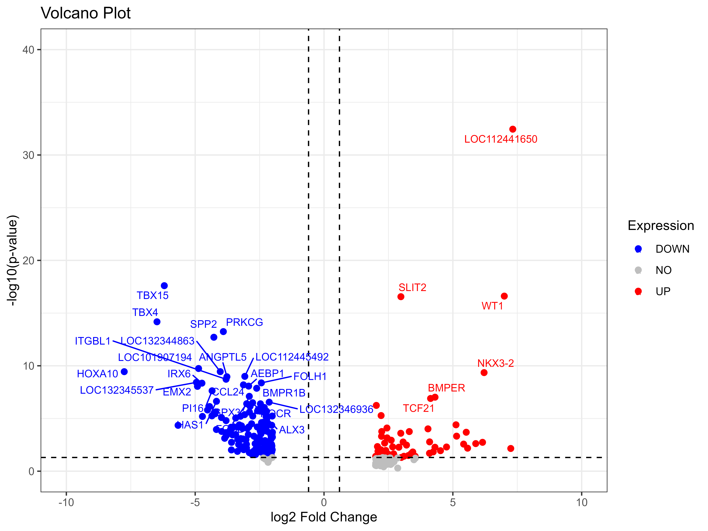
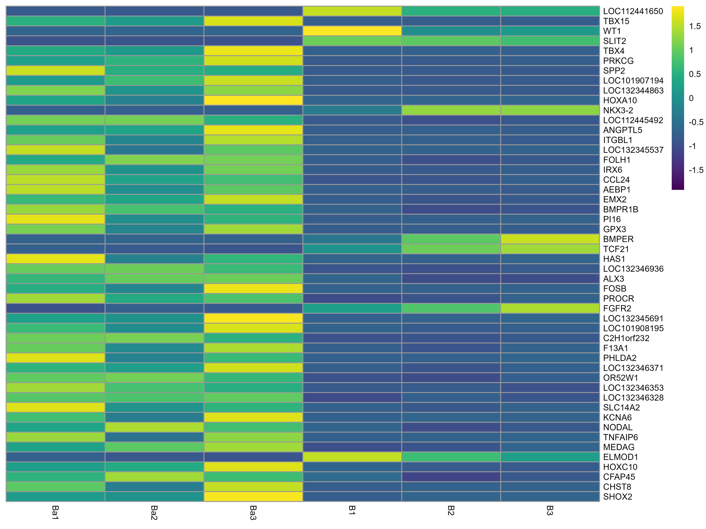

# RNA-seq Gene Expression Visualization in R
This repository provides R scripts for visualizing differential gene expression results using two commonly used plots in transcriptomics analysis:

**Volcano Plot** – highlights significantly upregulated and downregulated genes.
<br>
**Heatmap** – visualizes expression patterns of the most significant genes across samples.

These scripts are useful for RNA-seq differential expression analysis, microarray data analysis, and general gene expression studies.

---

# Requirements

The scripts require R (≥ 4.0) and the following packages:

```
ggplot2
ggrepel
pheatmap
grid
```

Install them using:

```r
install.packages(c("ggplot2","ggrepel","pheatmap"))
```

Load libraries:

```r
library(ggplot2)
library(ggrepel)
library(pheatmap)
library(grid)
```

---

# Input Data Format

Both scripts use a CSV file containing gene expression statistics.

Example file:
```
file1.csv
```

### Required columns for Volcano Plot

| Column | Description         |
| ------ | ------------------- |
| genes  | Gene identifiers    |
| logFC  | Log2 fold change    |
| PValue | Statistical p-value |

### Required columns for Heatmap

| Column        | Description                |
| ------------- | -------------------------- |
| genes         | Gene identifiers           |
| FDR           | False discovery rate       |
| Ba1, Ba2, Ba3 | Replicates for condition A |
| B1, B2, B3    | Replicates for condition B |

Example dataset structure:

```
genes,logFC,PValue,FDR,Ba1,Ba2,Ba3,B1,B2,B3
GeneA,1.25,0.001,0.01,5.3,6.2,5.9,10.1,9.8,11.2
GeneB,-0.82,0.032,0.02,7.1,6.8,7.4,4.2,5.0,4.5
```

---

# Volcano Plot Analysis

The volcano plot visualizes the relationship between fold change and statistical significance.

### Significance thresholds

* **Upregulated genes**

  ```
  logFC > 0.6  &  PValue < 0.05
  ```

* **Downregulated genes**

  ```
  logFC < -0.6  &  PValue < 0.05
  ```

### Plot Features

* Log2 Fold Change on the **x-axis**
* −log10(PValue) on the **y-axis**
* Significant genes highlighted
* Optional labeling of top significant genes
* Fold change and p-value threshold lines

Color scheme:

| Color | Meaning             |
| ----- | ------------------- |
| Red   | Upregulated genes   |
| Blue  | Downregulated genes |
| Grey  | Not significant     |

### Output

```
volcano_plot.png
```

Resolution: **600 dpi**

---

# Heatmap Analysis

The heatmap visualizes the top 50 genes ranked by False Discovery Rate (FDR).

### Workflow

1. Load gene expression dataset
2. Rank genes by FDR
3. Select top 50 significant genes
4. Extract expression values from selected samples
5. Scale values across rows
6. Generate heatmap using `pheatmap`

### Visualization Settings

* Row scaling enabled
* Gene names displayed
* Sample names displayed
* Clustering disabled
* Euclidean distance metric

### Color Gradient

The heatmap uses a custom gradient:

```
Purple → White → Green
```

representing:

* Low expression
* Medium expression
* High expression

### Output

```
heatmap.png
```

Resolution: **600 dpi**

---
# Example Figures
**Volcano Plot**



**Heatmap**



# Applications

These scripts are suitable for:

* RNA-seq differential expression analysis
* Transcriptomics research
* Microarray data visualization
* Exploratory gene expression analysis
* Publication-quality figures

---

# Author

Bhavya Maggo
---

